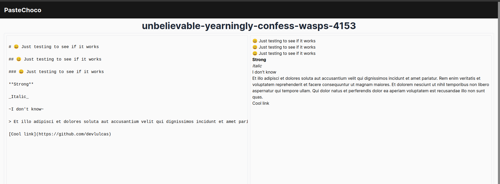

# 🍫 [PASTECHOCO.LAT](pastechoco.lat)

Create human readable, shareable links that lead to HTML files created from user input.

We have markdown support, so you can use markdown to format your text. You may also use HTML tags, but be careful, we do sanitize the input, so you can't use any JavaScript and some HTML tags will be removed.

It's free and open source, so you can host it yourself if you want to. It's just a simple app with questionable security, so feel free to improve it.

## TODO

- [ ] Add a way to delete pastes
- [ ] Add a way to edit pastes
- [ ] Add a way to view all pastes
- [ ] Make the app look better
- [ ] Add a captcha to prevent spam
- [ ] Add logging
- [ ] Deploy the app to a server
- [ ] Buy a domain name
- [ ] Add syntax highlighting
- [ ] Add some SEO juice
